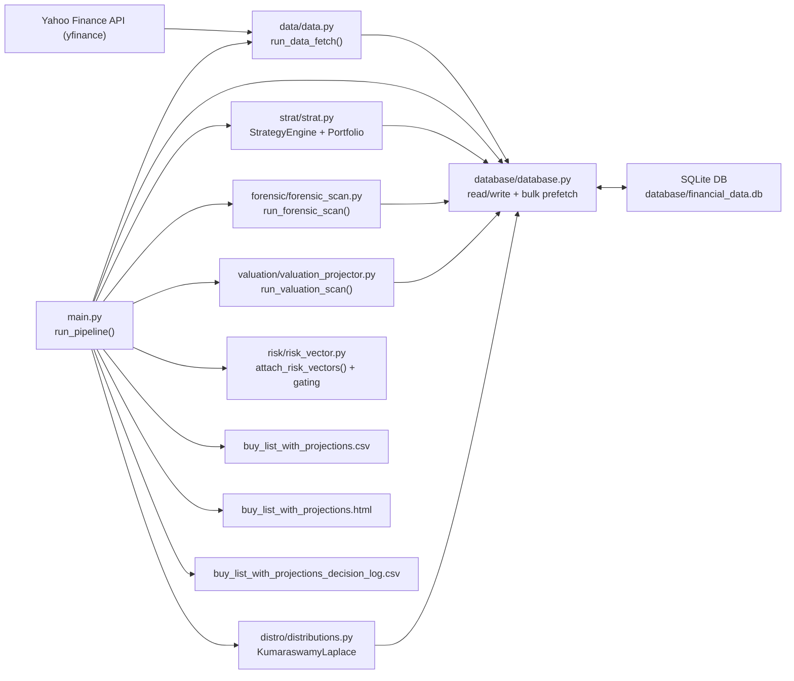
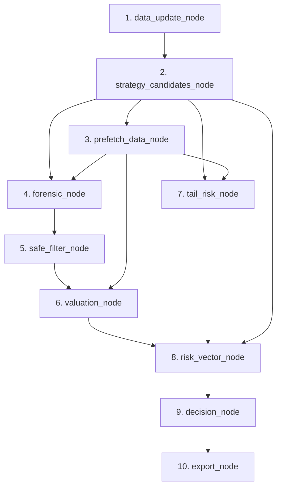

# Yahoo Project (`MarketLedger`) Operator Runbook

`MarketLedger` is a local-first quantitative equity research pipeline that uses Yahoo Finance as the upstream source and SQLite as the local system of record. It is built to let operators run repeatable ingestion, screening, forensic filtering, valuation, risk-vector gating, and export workflows from the command line.

## Table of Contents

- [TL;DR (30-Second Start)](#tldr-30-second-start)
- [Architecture Diagrams](#architecture-diagrams)
- [Who This Is For](#who-this-is-for)
- [Prerequisites](#prerequisites)
- [Installation](#installation)
- [Quick Start Workflows](#quick-start-workflows)
- [Command Reference: Data Ingestion](#command-reference-data-ingestion)
- [Command Reference: Main Pipeline](#command-reference-main-pipeline)
- [Pipeline Stages Explained](#pipeline-stages-explained)
- [Outputs and File Contracts](#outputs-and-file-contracts)
- [Interpreting Signals and Risk Fields](#interpreting-signals-and-risk-fields)
- [Database and Data Model](#database-and-data-model)
- [Backtesting and Research Queries](#backtesting-and-research-queries)
- [Testing](#testing)
- [Troubleshooting](#troubleshooting)
- [Known Limitations](#known-limitations)
- [FAQ](#faq)
- [Versioning / Change Log Stub](#versioning--change-log-stub)

## TL;DR (30-Second Start)

Why this matters: this is the fastest path from empty environment to a real output file.

```powershell
py -m pip install pandas numpy scipy yfinance tqdm pytest jinja2
py -m data.data AAPL MSFT GOOGL --exchange CUSTOM
py -m main --output .\buy_list_with_projections.csv
```

Then inspect:

- `buy_list_with_projections.csv`
- `buy_list_with_projections.html`
- `buy_list_with_projections_decision_log.csv` (unless disabled)

## Architecture Diagrams

Why this matters: these visuals show how modules connect and how the DAG executes.

### Module Architecture (Core Runtime)



### Pipeline DAG (Node Dependencies in `run_pipeline`)



## Who This Is For

Why this matters: this README is optimized for operational execution, not theory.

- Primary audience: operators running ingestion, analysis, and exports on local machines.
- Secondary audience: contributors who need command/reference behavior quickly.
- Not in scope: beginner investing education or portfolio advice.

## Prerequisites

Why this matters: most runtime issues come from missing environment assumptions.

- Python: `3.11` tested in this workspace.
- Shell examples: PowerShell from repository root (`c:\Users\Benjamin\Documents\Yahoo_project\MarketLedger`).
- Network: required for Yahoo Finance data fetches.
- Disk: SQLite data can grow into multiple GB depending on universe/history depth.

## Installation

Why this matters: there is no pinned dependency file yet, so manual install is required.

```powershell
py -m pip install pandas numpy scipy yfinance tqdm pytest jinja2
```

Notes:

- `jinja2` is optional. If missing, HTML exports still work but without row highlighting.
- No lockfile is introduced in this documentation pass.

## Quick Start Workflows

Why this matters: different operating goals need different command paths.

### Workflow A: First Run with a Few Symbols

```powershell
py -m data.data AAPL MSFT GOOGL --exchange CUSTOM
py -m main --output .\buy_list_small.csv
```

Use this to validate local setup quickly.

### Workflow B: Full-Universe Cached Run (Default NYSE Seed)

```powershell
py -m data.data
py -m main
```

Behavior:

- First command initializes DB and fetches tickers from `Utils/nyse_tickers.txt`.
- Second command runs the full pipeline using cached local data by default.

### Workflow C: Refresh + Strict Validation

```powershell
py -m main --update --strict --max-workers 4
```

Use this for higher-integrity runs when schema/data contract violations should fail fast.

## Command Reference: Data Ingestion

Why this matters: ingestion determines all downstream data quality and coverage.

CLI entrypoint:

```powershell
py -m data.data [tickers...] [--exchange EXCHANGE]
```

### Arguments

| Argument | Effect | Example |
| --- | --- | --- |
| `tickers` (positional, optional) | Fetch only specified symbols. | `py -m data.data AAPL MSFT` |
| `--exchange` | Sets exchange label saved with symbols (default `CUSTOM` when tickers are specified). | `py -m data.data AAPL --exchange NASDAQ` |
| `--TICKER` style unknown flags | Also parsed as tickers via `parse_known_args()` fallback. | `py -m data.data --AAPL --MSFT` |

### Default behavior with no tickers

If no tickers are provided, ingestion calls `fetch_nyse_data()` and reads:

- `Utils/nyse_tickers.txt`

Related helper files:

- `Utils/sp500_tickers.txt`
- `Utils/nasdaq_tickers.txt`

### Optional Python helper path

If you want to seed from a specific packaged file helper:

```powershell
py -c "from data.data import fetch_sp500_data; fetch_sp500_data(verbose=True)"
```

## Command Reference: Main Pipeline

Why this matters: this is the production operator interface for screening and exports.

CLI entrypoint:

```powershell
py -m main [flags]
```

### Flags

| Flag | Effect | When to use |
| --- | --- | --- |
| `--update` | Runs data update before analysis. | Daily/periodic refresh runs. |
| `--exchange` | Filters universe by exchange label in DB (for example `NASDAQ`, `SP500`, `NYSE`, `CUSTOM`). | Segment-specific runs. |
| `--no-momentum` | Disables momentum filter and momentum gate requirement. | Investigate value names below MA200. |
| `--output`, `-o` | Output CSV path. HTML uses same basename with `.html`. | Controlled artifact paths/names. |
| `--quiet`, `-q` | Suppresses progress logging. | Batch automation logs. |
| `--strict` | Enforces data contracts as hard failures. | High-integrity CI-like runs. |
| `--selected-only` | Do not include rejected assets in decision log export intent. | Smaller operational artifacts. |
| `--no-decision-log` | Disables decision log CSV export entirely. | Output minimization. |
| `--max-workers` | Overrides parallel worker count (`ExecutionConfig`). | Runtime tuning / DB contention control. |
| `--no-bulk-prefetch` | Disables bulk prefetch optimization before forensic/valuation/tail steps. | Debug data-fetch path behavior. |
| `--no-parallel` | Disables parallel forensic/valuation/tail stages. | Diagnose threading/contention issues. |
| `--no-tail-cache` | Disables in-run tail-fit caching. | Validate uncached tail-fit behavior. |
| `--legacy-pipeline` | Uses deprecated chronological fallback path. | Regression debugging only. |

### Recommended operator profiles

`fast-debug`:

```powershell
py -m main --no-parallel --no-bulk-prefetch --no-tail-cache --max-workers 1
```

`full-analysis`:

```powershell
py -m main --update --strict --max-workers 4
```

`quiet-batch`:

```powershell
py -m main --quiet --output .\runs\run_2026_02_27.csv
```

Note: create directories such as `.\runs\` before using them.

## Pipeline Stages Explained

Why this matters: understanding stage boundaries makes troubleshooting and auditability faster.

The main run uses a DAG with 10 nodes:

1. `data_update_node`: optional data refresh (`--update`).
2. `strategy_candidates_node`: strategy screen with default portfolio combos.
3. `prefetch_data_node`: bulk prefetch of history/fundamentals.
4. `forensic_node`: Altman Z forensic scoring and SAFE filtering prep.
5. `safe_filter_node`: extracts `Distress Risk == SAFE`.
6. `valuation_node`: scenario valuation + confidence fields.
7. `tail_risk_node`: distribution fit and tail-risk enrichment.
8. `risk_vector_node`: attaches `RV_*`, applies gates, sets `Decision*` fields.
9. `decision_node`: keeps only `Decision == selected` for final portfolio.
10. `export_node`: writes CSV, HTML, and optional decision log CSV.

High-level data flow:

- Inputs: local SQLite history/fundamentals (+ optional refresh).
- Intermediate: `Ticker`-keyed DataFrames merged across stages.
- Outputs: selected portfolio artifacts plus optional rejected/decision records.

## Outputs and File Contracts

Why this matters: downstream automation should rely on stable file and column expectations.

### Default output files

If no `--output` is passed:

- `buy_list_with_projections.csv`
- `buy_list_with_projections.html`
- `buy_list_with_projections_decision_log.csv` (if decision log export enabled and populated)

If `--output .\my_run.csv` is passed:

- `.\my_run.csv`
- `.\my_run.html`
- `.\my_run_decision_log.csv` (when enabled/populated)

### Portfolio CSV contract (selected assets only)

Typical key columns:

| Column | Meaning |
| --- | --- |
| `Ticker` | Symbol key used across stages. |
| `Strategy` | Strategy labels that selected the ticker. |
| `Current Price` | Latest price used in valuation/risk decisions. |
| `Fair Value (Bear)` / `(Base)` / `(Bull)` | Scenario valuation outcomes. |
| `Fair Value` | Probability-weighted fair value. |
| `Valuation Method` | Method used (`DCF`, `P/S`, `P/B`, or `N/A`). |
| `Undervalued %` | Margin-of-safety style signal (% string). |
| `Investment Signal` | Final signal derived from risk-vector-aware gating logic. |
| `Model Confidence` / `Confidence Score` | Epistemic confidence output. |
| `RV_Gate_Count` | Total active gates tripped for the asset. |

### Decision log CSV contract (selected + rejected candidates)

Key control fields:

| Column | Meaning |
| --- | --- |
| `Decision` | `selected` or `rejected`. |
| `DecisionStage` | Where rejection occurred (`momentum`, `distress`, `valuation_sanity`, `tail_risk`, or `selected`). |
| `RejectedReason` | Human-readable reason for rejection. |

Required risk-vector columns from pipeline contract:

| Column | Meaning |
| --- | --- |
| `RV_Version` | Risk-vector schema version. |
| `RV_Gate_Count` | Number of gates tripped. |
| `RV_Distress_Bucket` | Distress bucket normalization. |
| `RV_Tail_Bucket` | Tail-risk bucket normalization. |
| `RV_Momentum_Regime` | Momentum regime bucket. |

Additional `RV_*` fields may be present (gate booleans, valuation sanity ratio/reason, tail parameters).

## Interpreting Signals and Risk Fields

Why this matters: these fields drive operator decisions and should not be treated as black-box labels.

### Investment Signal semantics

Signals are derived using valuation sanity, distress, tail risk, momentum, and margin-of-safety logic:

- `Strong Buy`: bear-protected and strong base margin of safety.
- `Speculative Buy`: strong base upside with bear-case downside.
- `Hold`: positive but modest margin of safety.
- `Caution`: heavy tail risk or momentum gate conditions.
- `Avoid`: distress gate failure.
- `Overvalued`: negative margin of safety.
- `Needs Review`: valuation sanity failure or invalid pricing context.

### `RV_Gate_Count` and gate booleans

`RV_Gate_Count` is the count of tripped gates:

- `RV_Gate_Distress`
- `RV_Gate_Tail`
- `RV_Gate_Momentum`
- `RV_Gate_Valuation`

Gate precedence in stage assignment:

1. distress
2. valuation_sanity
3. tail_risk
4. momentum
5. selected

### Trend projection caveat

`Trend_Proj_6M`, `Trend_Proj_1Y`, and `Trend_Proj_3Y` are historical CAGR extrapolations, not explicit price targets.

## Database and Data Model

Why this matters: the SQLite store is the operational backbone for all runs.

Primary DB file:

- `database/financial_data.db`

Core tables:

- `tickers`
- `history`
- `balance_sheet`
- `income_statement`
- `cash_flow`
- `financials`
- `earnings`

Helpful inspection commands:

```powershell
py -m database.database stats
py -m database.database history AAPL
py -m database.database summary AAPL
py -m database.database search AAP
py -m database.database metrics income_statement
```

Interactive mode:

```powershell
py -m database.database interactive
```

## Backtesting and Research Queries

Why this matters: research-mode outputs let you analyze stability and failure modes, not just single-run picks.

### Run a query-ready research backtest

```python
from Utils.backtester import VectorBacktester

bt = VectorBacktester(reporting_lag_days=90)
bt.load_data()
outputs = bt.run_research_backtest(
    start_date="2022-01-01",
    end_date="2024-12-31",
    strategy="magic_formula",
    top_n=10,
    holding_months=1,
    verbose=True,
    show_progress=True,
    max_workers=4,
)

asset_panel = outputs["asset_panel"]
portfolio_panel = outputs["portfolio_panel"]
equity_panel = outputs["equity_panel"]
```

### Signal stability query

```python
signal_stability = bt.query_signal_stability(asset_panel)
print(signal_stability.head())
```

### Gate trip-rate query

```python
gate_rates = bt.query_gate_trip_rates(asset_panel)
print(gate_rates.head())
```

### Drawdown failure query

```python
drawdown_events = bt.query_drawdown_failures(equity_panel, threshold=-0.15)
print(drawdown_events.head())
```

## Testing

Why this matters: tests validate critical research and gating behavior before relying on outputs.

Run from repository root:

```powershell
py -m pytest -q
```

Current tests validate:

- `tests/test_risk_vector.py`: risk-vector mapping, gate precedence, signal attachment.
- `tests/test_performance_paths.py`: forensic/valuation prefetch paths and research panel assembly behavior.
- `tests/test_backtester_queries.py`: query outputs for signal stability, gate rates, drawdown failure detection.

## Troubleshooting

Why this matters: these are the most common operator failure modes in this project.

### Missing dependency errors

Symptom: import/module errors for `pandas`, `numpy`, `scipy`, `yfinance`, `tqdm`, or `pytest`.

Fix:

```powershell
py -m pip install pandas numpy scipy yfinance tqdm pytest jinja2
```

### Pipeline exits with code `1` and no picks

Symptom: `py -m main` exits non-zero.

Cause: pipeline returns an empty selected portfolio (expected behavior in current CLI exit logic).

Checks:

- confirm DB has data (`py -m database.database stats`)
- rerun with `--update` to refresh
- rerun with `--no-momentum` to inspect whether momentum gating is too restrictive

### No/old DB data

Symptom: very few candidates or stale outcomes.

Fix:

```powershell
py -m main --update
```

Or reseed:

```powershell
py -m data.data
```

### Slow runtime or SQLite contention

Symptom: long stage times, unstable performance at higher worker counts.

Fix options:

- lower workers: `--max-workers 1` or `--max-workers 2`
- disable parallelism entirely: `--no-parallel`
- disable bulk prefetch for debugging: `--no-bulk-prefetch`

### HTML styling missing

Symptom: HTML report renders as plain table without conditional row styling.

Cause: `jinja2` not installed (pipeline catches this and falls back by design).

Fix:

```powershell
py -m pip install jinja2
```

## Known Limitations

Why this matters: use outputs with clear expectations about model and data limits.

- Yahoo Finance endpoints can change behavior, return missing fields, or be temporarily unavailable.
- Data quality varies by ticker and reporting period; fallback valuation paths (`P/S`, `P/B`) may be used.
- High worker counts can increase SQLite contention in local runs.
- Scenario outputs and trend projections are model artifacts, not guaranteed forecasts.
- This software is for research and operational analysis, not investment advice.

## FAQ

Why this matters: these are common operator questions that affect day-to-day usage.

### 1) Does the pipeline always refresh data?

No. It uses cached DB data by default; pass `--update` to refresh first.

### 2) Why is there no decision log file in my run?

A decision log is skipped if you passed `--no-decision-log`, or if no decision rows are available.

### 3) What does `--selected-only` change?

It suppresses rejected assets in decision-log export intent (`include_rejected=False`), reducing output noise.

### 4) How do I run without momentum gating?

Use:

```powershell
py -m main --no-momentum
```

### 5) Can I run only a few tickers for quick checks?

Yes:

```powershell
py -m data.data AAPL MSFT GOOGL --exchange CUSTOM
py -m main --exchange CUSTOM
```

### 6) How do I inspect what data is in SQLite?

Use:

```powershell
py -m database.database stats
py -m database.database history AAPL
```

### 7) Where do `RV_*` columns come from?

They are flattened from the `RiskVector` model in `risk/risk_vector.py` during `risk_vector_node`.

### 8) Why do I get `Needs Review` as `Investment Signal`?

Usually valuation sanity failed or required price/fair-value context was invalid.

## Versioning / Change Log Stub

Why this matters: operator docs need a lightweight change record as flags/contracts evolve.

- `README v2` (current): expanded operator-first runbook, full CLI references, output contracts, and troubleshooting.
- Next update: add explicit dated entries when CLI flags, output schemas, or run profiles change.

